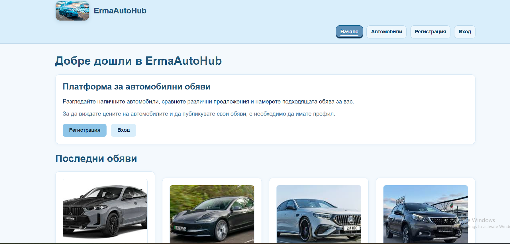
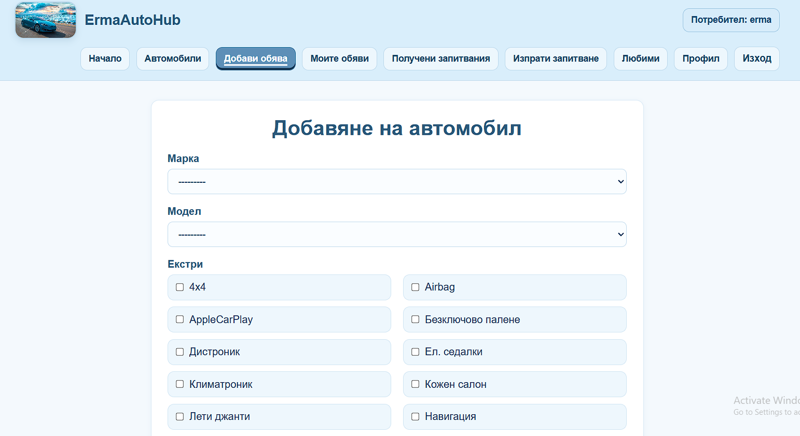
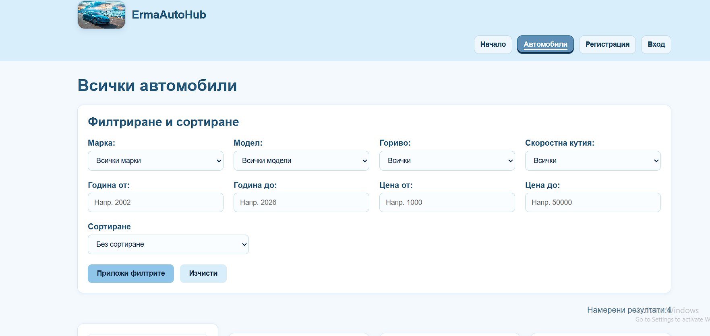

# *ErmaAutoHub

ErmaAutoHub е Django уеб приложение за публикуване, разглеждане и управление на автомобилни обяви. Проектът включва публична част за анонимни потребители и частна такава за регистрирани потребители с ролево поведение и ограничен достъп.

## Основни функционалности

- Регистрация, вход и изход на потребители
- Публичен каталог с автомобили с филтриране и сортиране
- Създаване, редакция и изтриване на собствени обяви
- Изпращане и получаване на запитвания
- Любими автомобили и любими марки в профила
- Модераторски процес за одобряване на обяви
- DRF API за публикувани и одобрени автомобили
- Асинхронна задача, която създава лог при изпращане на нова обява за одобрение

## Архитектура

- `accounts` - регистрация, профил, любими, роли
- `cars` - автомобилни обяви, галерия, async review logs
- `catalog` - марки, модели, екстри
- `inquiries` - запитвания между потребители и продавачи
- `core` - начална страница и общи изгледи
- `api` - REST API endpoint-и

## Връзки между моделите
-`User` -> `Profile`  
-`User` -> `Car`   
-`Brand` -> `CarModel`   
-`Brand` -> `Car`   
-`CarModel` ->` Car`  
-`Car` -> `Inquiry`  
-`Car` -> `CarImage`   
-`Car` <-> `Feature`   
-`Profile` <-> `Brand`   
-`User` <-> `Car` чрез `Favorite`   

## Бизнес логика

-Само собственикът може да редактира и изтрива своя обява  
-Само собственикът може да управлява галерията на своя автомобил  
-Новите обяви се създават като чакащи одобрение  
-Само модератор може да одобрява чакащи обяви  
-Анонимните потребители не виждат цената на автомобила  
-Запитвания се изпращат към собственика на конкретната обява  
-При нова обява се създава async review log  
-Моделът трябва да принадлежи на избраната марка  

## Роли и поведение

- `Dealers` могат да създават, редактират, изтриват и управляват собствените си обяви; могат да изпращат запитвания и да виждат получените запитвания
- `Moderators` могат да управляват марки, модели, екстри и да одобряват чакащи обяви
- `Superuser` има пълен достъп и може да използва Django admin
- Анонимните потребители могат да виждат, филтрират и сортират обяви , но без да виждат цената на автомобила.


## Технологии:

- Python 3.10+
- Django 5.2.12
- Django REST Framework 3.17.0
- PostgreSQL

## Screenshots:

### Начална страница



### Добавяне на автомобил



### Търсене на автомобил



## Локално стартиране:

1. Клониране на repository-то.
2. Създаване и активиране на virtual environment.
3. Инсталиране на зависимостите.
4. Настройка на PostgreSQL база данни.
5. Прилагане на миграциите.
6. Стартиране на development server.

Пример:

```powershell
python -m venv .venv
.\.venv\Scripts\activate
pip install -r requirements.txt
python manage.py migrate
python manage.py runserver
```

## Environment променливи

Проектът трябва да използва environment variables за чувствителните стойности в production. Примерна конфигурация има в `.env.template`.

Нужни променливи:

- `SECRET_KEY`
- `DEBUG`
- `ALLOWED_HOSTS`
- `CSRF_TRUSTED_ORIGINS`
- `DB_NAME`
- `DB_USER`
- `DB_PASSWORD`
- `DB_PORT`
- `CLOUDINARY_CLOUD_NAME`
- `CLOUDINARY_API_KEY`
- `CLOUDINARY_API_SECRET`


## База данни, static и media файлове

- База данни: PostgreSQL (Azure Database for PostgreSQL или локална)
- Static файлове за production се обслужват чрез `whitenoise`
- Media файлове: `Cloudinary` (в production) / `media/` (локално)


## API

Налични endpoint-и:

- `GET /api/cars/` - списък с публикувани и одобрени автомобили
- `GET /api/cars/<id>/` - детайли за един публикуван и одобрен автомобил

API-то е достъпно за анонимни потребители, като част от данните се контролират от serializer логиката.

## Стартиране на тестовете

```powershell
python manage.py test accounts cars api
```

Текущото автоматизирано покритие включва:

- роли и групи
- profile favorites
- car form и list логика
- owner CRUD за inquiries
- owner CRUD за car images
- API endpoint-и
- async review log

## Deployment

Проектът е успешно деплойнат в продукционна среда на платформата Microsoft Azure (Azure App Services).

- **Хостинг:** Azure App Service (Linux) с Gunicorn HTTP сървър.
- **База данни:** Azure Database for PostgreSQL (или друга външна база данни).
- **Снимки / Media:** Интеграция с Cloudinary Cloud Storage.
- **Статични файлове:** Обслужват се чрез Whitenoise (настроен в `settings.py`).

### Полезни връзки (Live)
- **Live URL:** [http://ermaautohub-b6c6ehfccje0ahhz.italynorth-01.azurewebsites.net/](http://ermaautohub-b6c6ehfccje0ahhz.italynorth-01.azurewebsites.net/)
